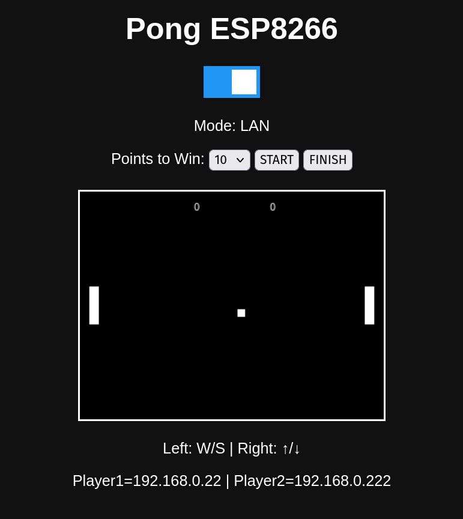
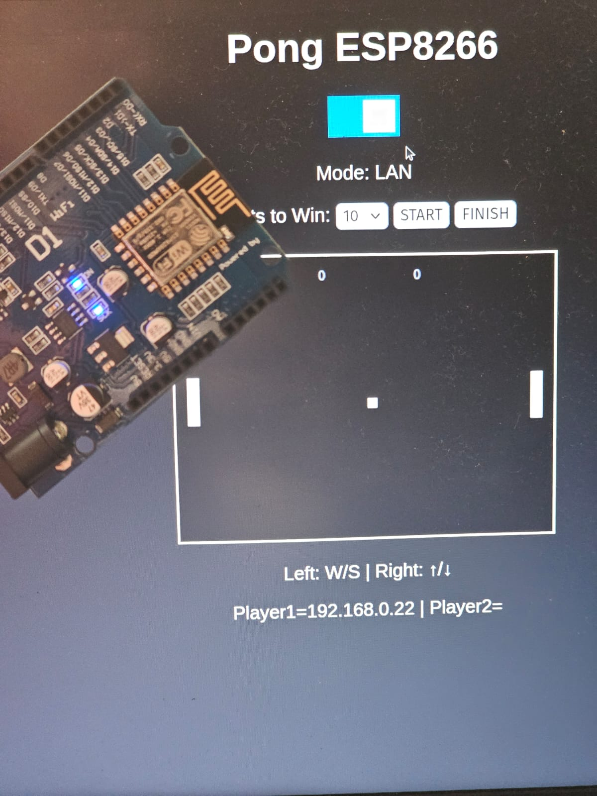

# Pong Multiplayer on ESP8266

[🇧🇷 Leia em Português](README.pt.md)

## Overview

This project implements a multiplayer Pong game hosted entirely on a
single ESP8266 board.

It serves the game via HTTP using LittleFS and synchronizes players
using AJAX polling at a fixed 24 FPS game loop.

The architecture separates the rendering layer (browser) from the game
logic (ESP8266), ensuring stable performance and low memory
fragmentation.

## Images

<table>
  <tr>
    <td></td>
    <td></td>
  </tr>
</table>

------------------------------------------------------------------------

## Features

-   24 FPS fixed game loop
-   Optimized JSON using snprintf (no heap fragmentation)
-   Two gameplay modes:
    -   LOCAL (same browser, same keyboard)
    -   LAN (two devices on the same network)
-   IP-based player identification
-   Configurable max score (5--25)
-   Start / Finish controls
-   Automatic winner detection
-   Popup notification system
-   Game reset on close

------------------------------------------------------------------------

## Game Modes

### LOCAL Mode

-   Same computer
-   Same browser tab
-   Same keyboard
    -   Player 1 → W / S
    -   Player 2 → Arrow Up / Arrow Down

Frontend explicitly defines which paddle to move.

### LAN Mode

-   Two devices on the same local network
-   ESP8266 assigns:
    -   First IP → Player 1 (W/S)
    -   Second IP → Player 2 (Arrow keys)
-   Backend validates movement using remoteIP()

------------------------------------------------------------------------

## Technical Architecture

-   ESP8266WebServer
-   LittleFS static hosting
-   Fixed timestep game loop (millis-based)
-   GameState struct holding:
    -   Paddle positions
    -   Ball position and velocity
    -   Score
    -   Max score
    -   Winner state
    -   Player IPs

------------------------------------------------------------------------

## Setup

1.  Edit WiFi credentials in the sketch.
2.  Upload sketch to ESP8266.
3.  Upload /data folder via LittleFS.
4.  Open the IP shown in Serial Monitor.
5.  Select mode and start playing.

------------------------------------------------------------------------

## Future Improvements
-   Bug in LAN mode
-   WebSocket real-time sync
-   Single-player mode
-   Auto-disconnect detection
-   Touch controls for mobile
-   Support more than 2 players with multiple paddles.
